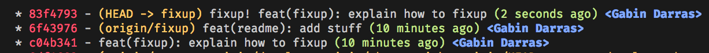

author: Gabin Darras
summary: Git Advanced
id: codelabs-gitAdvanced
categories: git
environments: javascript
status: draft
feedback link: github.com/gabindarras
analytics account: 0

# Git - Avancé

## Présentation

Ce CodeLabs a pour but de faire de vous des référents Git !

Une question ? Une difficulté ? : **gabin.darras@ineat-conseil.fr**

Pré-requis:

- Avoir **git** installé sur votre machine.
- Avoir un compte Github/Gitlab pour pouvoir forker le projet.
- Être à l'aise avec les bases de git, n'hésitez pas à suivre le CodeLabs débutant dans le cas contraire.
- Être à l'aise avec les notions intermédiares de Git, n'hésitez pas à suivre le CodeLabs intermédiare dans le cas contraire.

## Récupération du projet

Forker le projet git-advanced puis le récupérer avec la commande

```
git clone le-nom-de-votre-projet-après-le-fork
```

## Cherry-pick

```
git cherry-pick SHA-1
```

Cette commande permet de prendre tout le contenu d'un commit et de le rappatrier sur une autre branche. C'est en quelque sorte un rebase plus fin.

Prenons un exemple:
Sur la branche **branche-a-cherry-pick** se trouve 2 commits, un où nous avons ajouté un nouveau fichier (test.txt) et le second où nous avons modifié le contenu du fichier README.md.
Nous créons une seconde branche dans laquelle nous aurons besoin du fichier test.txt, présent je le rappelle uniquement sur la branche **branche-a-cherry-pick**. On pourrait très bien rebase cette dernière mais nous ne sommes pas intéressé par le second commit (en plus il parait que c'est un commit qui sera réécrit par la suite), Le cherry-pick est donc parfaitement adapté ici.
Mettez-vous sur la branche **branche-a-cherry-pick** et copiez le SHA-1 du commit concernant l'ajout du fichier test.txt. Une fois fait mettez-vous sur la branche **cherry-pick** et exécutez la commande suivante :

```
git cherry-pick SHA-1-du-commit-de-la-branche-a-cherry-pick
```

> Le cherry-pick étant assez proche du rebase, vous pouvez être confrontés aux mêmes problématiques (conflits par exemple). Les commandes à exécuter dans ces cas-là sont les mêmes, seul le mot-clé change : git cherry-pick --abort, git cherry-pick --continue etc...

## Rebase --onto

Pour expliquer le rebase onto on peut reprendre une partie de notre exemple du cherry-pick. En effet au lieu de cherry-pick un commit de la branche **branche-a-cherry-pick** on va carrément tirer notre nouvelle branche (qu'on va appeler **rebase-onto**) de cette dernière comme ça on ne se prend pas la tête et on a tous les commits !
Quand on n'est pas très à l'aise avec Git, tirer une branche à partir d'une autre branche que la **develop** peut s'avérer source d'ennui et de perte de temps et de sang-froid !

Comme nous l'avons vu dans la section précédente, le second commit de la branche **branche-a-cherry-pick** est un commit temporaire donc il va être réecrit et la branche va être force push. A vous de jouer maintenant :

- Allez sur la branche **branche-a-cherry-pick**, ajoutez du contenu au fichier README.md et réécrivez le commit.
- Retournez maintenant sur la branche **rebase-onto**, modifiez le fichier test.txt et commitez tout ça.
- Mergez la branche **branche-a-cherry-pick** sur **develop**
- Mergez la branche **rebase-onto** (Enfin...essayez :))

Et c'est la que les problèmes arrivent ! En effet comme nous avons tiré notre branche d'une branche dont l'historique n'était pas sec, Git se retrouve complément perdu. Il est très facile de s'en rendre compte rapidement, pour cela faites un git lg pour regarder votre historique. Hum c'est bizarre il n'y a plus aucune trace ni de la branche **develop** ni de la branche **branche-a-cherry-pick**. Pour le moment notre branche est perdu dans les limbes et il est impossible en l'état des choses de la merge à la **develop**. Nous allons donc devoir la "recalibrer".

Pour cela, copiez le SHA-1 du commit que vous avez écrit puis

```
git rebase --onto SHA-1-du-commit~ origin/develop
```

> ~ indique qu'on se place juste avant ce commit, l'équivalent serait de prendre le commit parent.

Pour s'assuer que notre branche a bien été recalibrée nous pouvons faire un git lg pour regarder son historique. Il semblerait que tout soit finalement rentrer dans l'ordre. Vous pouvez maintenant merger cette branche sur la **develop** :)

## Commit de fixup

Dans le CodeLabs intermédiaire nous avons comment réécrire l'historique grâce au rebase intéractif (Si vous n'êtes pas à l'aise avec cette notion c'est le moment d'aller voir :)). Voici un exemple : On se rencontre qu'on a oublié d'écrire la doc sur un service, et que ce service a déjà été commit et surtout qu'on en a crée plusieurs entre temps. On crée donc un autre commit spécifiquement pour la doc puis on lance le rebase intéractif, etc etc le process habituel.
Nous allons voir ici comment améliorer ce process pour le faire en une seule ligne !

Vous pouvez aller sur la branche **fixup**. Sur cette branche il y a 2 commits : un qui concerne le fichier fixup.txt fraîchement crée et le 2e pour le fichier README.md. Seulement voila, nous avons oublié de remplir le fichier fixup.txt !

Petit exercice d'échauffement : Ajouter dans ce fichier les commandes que vous utiliserez pour fixup ce fichier. C'est fait ? Maintenant appliquez ces commandes :)

Maintenant que l'échauffement est terminé nous pouvons passer aux choses sérieuses !

- Regardez l'historique de la branche grâce au git lg et copiez le SHA-1 du commit concernant le fichier fixup.txt.
- Effacez le contenu du fichier fixup.txt et ajoutez la commande ci-dessous:

```
git commit --fixup SHA-1
```

> SHA-1 étant celui du commit que vous avez copié précédemment.

Cette commande va créer un commit de fixup, c'est à dire qu'elle va automatiquement lier votre commit sous le commit concerné.



Ensuite exécutez la commande

```
git rebase -i --autosquash SHA-1~
```

> SHA-1 est toujours le même que celui que vous avez copié précédemment.

Vous devriez voir le commit de fixup sous le commit de référence.

Nous allons maintenant créer un alias qui va toutes ces commandes pour nous, pour cela :

```
git config --global -e
```

puis au niveau des alias ajoutez :

```
[alias]
       fixup = !sh -c 'SHA=$(git rev-parse $1) \
       && git commit --fixup $SHA \
       && git rebase -i --autosquash $SHA~' -
```

Une fois l'alias modifié vous pouvez également l'ajouter dans le fichier fixup.txt...puis fixup la modification. Nous allons bien évidemment utiliser l'alias que nous venons de créer. La seule chose à faire de notre coté est de copier le SHA-1 du commit sur lequel on veut appliquer le fixup. Ensuite :

```
git fixup SHA-1
```

La fenêtre de rebase s'ouvre et nous devons juste vérifier que tout est correct. Sauvegardez, quittez et regardez l'historique, c'est fort n'est-ce pas ! :)

## Reflog et reset

```
git reflog
```

Pendant que vous travaillez, Git enregistre l'emplacement de votre HEAD chaque fois que vous le changez. À chaque commit ou commutation de branche, le journal des références (reflog) est mis à jour.

Voici comment ça se présente

```
$ git reflog
1a410ef HEAD@{0}: 1a410efbd13591db07496601ebc7a059dd55cfe9: updating HEAD
ab1afef HEAD@{1}: ab1afef80fac8e34258ff41fc1b867c702daa24b: updating HEAD
```

Il est donc possible de revenir à une vieille version de votre HEAD en faisant la commande

```
git reset --hard SHA-1
```
